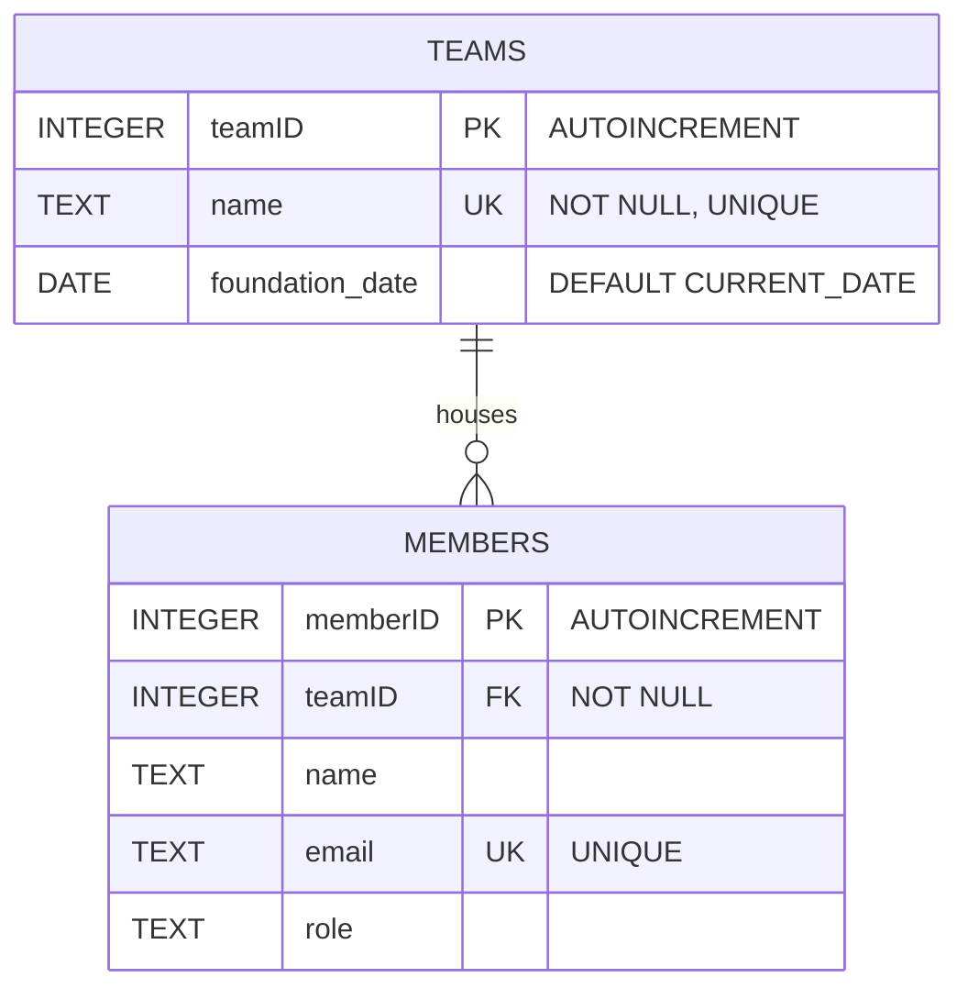

# 📑 Day 8: FastAPI Database Connection & Relational Schema Integration

## 📋 Overview & Implementation

The objective of today is to connect a backend server (FastAPI) to a relational database (SQLite) using raw SQL statements to perform read and write operations. This document describes how a FastAPI backend communicates with a SQLite database using raw SQL queries and a structured schema.

### ⚙️ Key Technical Features
* **Raw SQL Integration:** Bypassed ORMs (like SQLAlchemy) to interact directly with SQLite using Python's native `sqlite3` driver.
* **Database Initialization on Startup:** Hooked into FastAPI's `@app.on_event("startup")` lifecycle event to read and execute [db-mock_data.sql](file:///d:/Study/HK252/TTNT/Agility/Agilityio-internship-training/exercises/Day-8-DB-connect-BE/db-mock_data.sql) on server boot, ensuring tables are correctly structured and seeded with initial records.
* **Connection Safety:** Enforced referential integrity on every connection utilizing SQLite's key check `PRAGMA foreign_keys = ON;` and ensured connection resources are properly closed within `finally` blocks.
* **Input Validation & Sanitization:** Implemented Pydantic constraints and strict `.strip()` sanitation on teams create/update endpoints to reject empty or whitespace-only inputs.

---

## 🗄️ Database Schema Design

The database schema utilizes a standard **One-to-Many (1 -> N)** parent-child relational architecture representing project groups (`teams`) and practitioners (`members`).

### 🗺️ Entity-Relationship Diagram (ERD)

The relational connection and constraints between the tables are mapped below:

### 📖 Schema Structure and Fields Dictionary

#### Table A: `teams` (Parent Table)
Stores organizational group details.

| Field Name | Data Type | Constraints | Purpose / Explanation |
| :--- | :--- | :--- | :--- |
| **`teamID`** | `INTEGER` | `PRIMARY KEY AUTOINCREMENT` | Unique identifier for each team, generated sequentially. |
| **`name`** | `TEXT` | `NOT NULL UNIQUE` | The team's name. Enforces that team names cannot be null and must be unique. |
| **`foundation_date`** | `DATE` | `DEFAULT CURRENT_DATE` | Date when the team was founded. Defaults to the current date if omitted. |

#### Table B: `members` (Child Table)
Stores individual practitioner information linked to a team.

| Field Name | Data Type | Constraints | Purpose / Explanation |
| :--- | :--- | :--- | :--- |
| **`memberID`** | `INTEGER` | `PRIMARY KEY AUTOINCREMENT` | Unique identifier for each member, generated sequentially. |
| **`teamID`** | `INTEGER` | `NOT NULL`, `FOREIGN KEY` | References `teams(teamID)`. Binds the member to a valid team. |
| **`name`** | `TEXT` | None | Name of the member. |
| **`email`** | `TEXT` | `UNIQUE` | Email of the member. Enforces that email addresses must be unique. |
| **`role`** | `TEXT` | None | Functional title or role (e.g., 'Intern', 'Lead Engineer'). |

### 🛡️ Key Relational Integrity Constraints
1. **Primary Keys (`teamID`, `memberID`):** Enforces entity integrity, guaranteeing that every row can be uniquely identified.
2. **Foreign Key Constraint (`members.teamID` -> `teams.teamID`):** Enforces referential integrity, preventing orphans by checking that members are linked to a valid team ID.
3. **Delete Restrictions:** If a team is deleted while it still has active members in `members`, SQLite throws an `IntegrityError`, protecting relational safety.
4. **Unique Constraints (`teams.name`, `members.email`):** Prevents duplicate names or email records.
