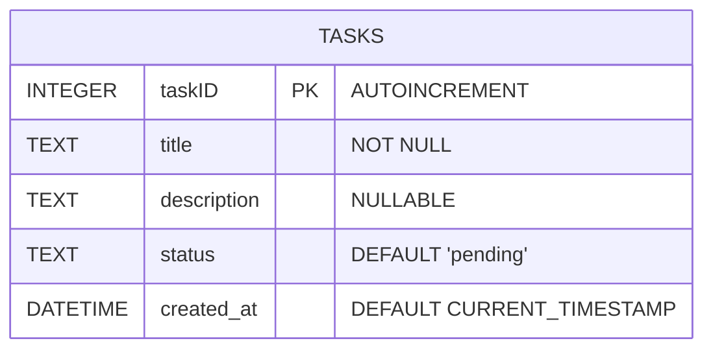

# 📝 Day 9 (Week 3, Day 1): Tasks CRUD API with FastAPI & SQLite (Raw SQL)

## 📋 Overview
The objective of this exercise is to combine HTTP endpoint design with direct relational database access. We build a RESTful CRUD API to manage **Tasks** using:
* **FastAPI** to construct the HTTP endpoints.
* **sqlite3** standard library module to interface directly with SQLite via raw SQL queries (no ORM).
* **Pydantic** to enforce schemas and run input sanitization (removing surrounding whitespace, blocking empty titles).

---

## 🗄️ Relational Schema Design

The `tasks` table stores task metadata and state details:



### Field Dictionary
* **`taskID`** (`INTEGER`, PRIMARY KEY, AUTOINCREMENT): Unique identifier.
* **`title`** (`TEXT`, NOT NULL): Title of the task. Validated to be non-empty and non-whitespace-only.
* **`description`** (`TEXT`, NULLABLE): Description of the task.
* **`status`** (`TEXT`, DEFAULT `'pending'`): Status constraint (`'pending'`, `'in_progress'`, `'completed'`).
* **`created_at`** (`DATETIME`, DEFAULT `CURRENT_TIMESTAMP`): The date and time when the task row was inserted.

---

## 🚀 Endpoint Reference

The API endpoints are grouped under the `/tasks` route prefix:

| Method | Endpoint | Summary | Path / Query Parameters | Response Body |
| :--- | :--- | :--- | :--- | :--- |
| **GET** | `/` | Welcome root message | None | Root message JSON |
| **GET** | `/tasks` | Retrieve all tasks | `status` *(optional query)* | List of all tasks (optionally filtered) |
| **GET** | `/tasks/{task_id}` | Retrieve one task | `task_id` *(path)* | Task JSON object, or `404 Not Found` |
| **POST** | `/tasks` | Create a task | None (Request Body) | Created task JSON, or `400 Bad Request` |
| **PUT** | `/tasks/{task_id}` | Update a task | `task_id` *(path)*, Body | Updated task JSON, or `404`/`400` |
| **DELETE** | `/tasks/{task_id}` | Delete a task | `task_id` *(path)* | Success message, or `404 Not Found` |

---

## ⚙️ How to Run & Verify

1. Navigate to the day's directory:
   ```bash
   cd exercises/Day-9-Simple-CRUD
   ```

2. Run the application using `uvicorn`:
   ```bash
   uvicorn main:app --reload
   ```

3. Interactive Documentation:
   Open your browser to `http://127.0.0.1:8000/docs` to view the auto-generated Swagger UI and test endpoints directly.
